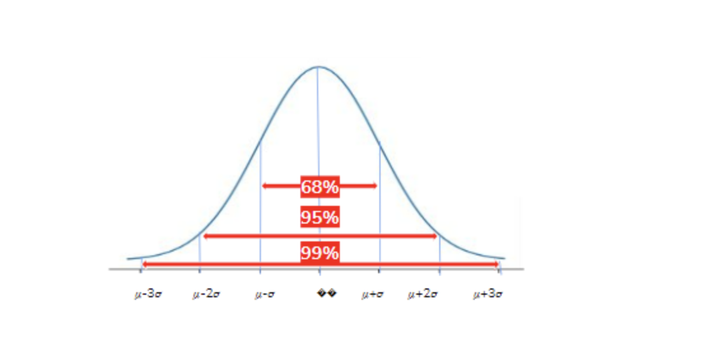
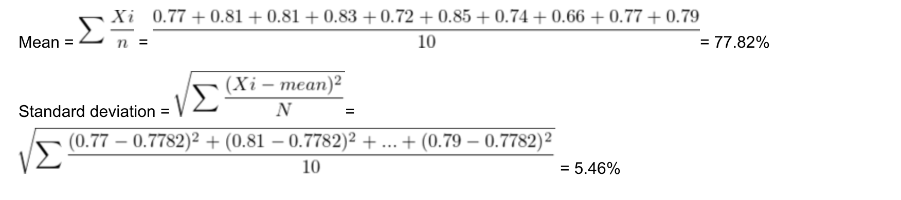
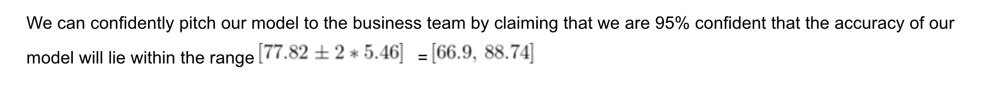

Here is the content converted to markdown format:

---

# Confidence Interval

*Confidence Interval will be introduced by the professor in the following lecture, let's have a quick look!*

We all certainly make claims in our day-to-day life and we commit to many statements with confidence. For example, "I am 90% sure that I can finish the assessment by this weekend." Similar claims can be made with respect to machine learning models as well. Let’s get familiar with a few terminologies before we understand confidence intervals.

### Terminologies

- **Mean:** It is the expected/average value of the data which is calculated by adding the data points and dividing them by the total number of data points. It is denoted by \( \mu \).

- **Standard deviation:** It is a measure of dispersion that tells you how dispersed the data is with respect to the mean. It is denoted by \( \sigma \).

- **Normal Distribution:** When we plot the data points, it forms a bell curve, and in simple terms, the data points lie around the mean value. The curve is symmetric around the mean.

### Properties of the Normal Distribution

- The total area under the curve is 1.
- About 68% of the data fall within 1 standard deviation from the mean, i.e., \( \mu \pm \sigma \).
- About 95% of the data fall within 2 standard deviations from the mean, i.e., \( \mu \pm 2\sigma \).
- About 99.7% of the data fall within 3 standard deviations from the mean, i.e., \( \mu \pm 3\sigma \).

### Confidence Interval

Confidence interval measures the certainty or uncertainty of an event in an interval that indicates the probability of the occurrence of an event will fall within the pair of values around the mean.

### Example

Let’s say we are building a model to classify if a person will buy a product or not. When we are ready with our model, we pitch this to a business team to use the model for making business decisions. The team will ask, "How confident are you that your model will give x% accuracy?"

To answer the business team, we validate our model on 10 different test sets and come up with 10 accuracy scores, i.e., [0.77, 0.81, 0.81, 0.83, 0.72, 0.85, 0.74, 0.66, 0.77, 0.79].

We know from the normal distribution that 95% of the data is covered within 2 standard deviations from the mean. From the 10 accuracy scores obtained from training the model, we can be 95% sure that our accuracy will lie within 2 standard deviations from the mean.

The mean accuracy obtained from the model is 77.82%, and the standard deviation of accuracy is 5.46%.

**Note:** We encourage you to go through the self-paced course “Statistical Learning” for a detailed understanding. You can refer to the “Estimation” video under “Inferential Statistics”.

---