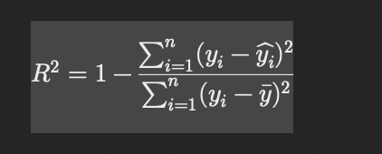

# Metrics involved in linear regression 

## R-Squared 

- How good your model is ? It ranges from 0 to 1, with higher values indicating a better fit.

## RMSE 

sqrt(avg((Act-pred)**2))

## MAE

- How far model predicted far from actual value
Avg(Abs(avg-pred))
## MAPE 

## Adj R2